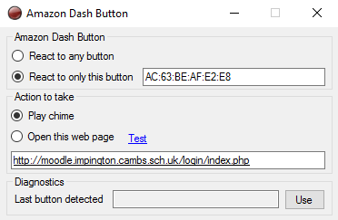

# Amazon Dash Button

## Purpose
This Windows app lets you make use of the Amazon Dash Button for something other than it's original purpose.

### How to use
Get your button connected to your wifi.  The simplest way is to install the Amazon Shopping app on your phone.

1. Sign in to your Amazon account from the Amazon Shopping app.
2. Connect your Dash Button to your wifi.
3. At this point abandon the setup and close the app. DO NOT configure a product to be ordered when the button is pressed.

Run this Amazon Dash Windows app to see this screen.  

Select "React to any button" and "Play Chime", then press your Amazon Dash button.  You should hear a sound.
You should also find that the box at the bottom has been filled in with the unique number of your Amazon Dash button.
Just to make sure that no other button or device can be used, click on the 'Use' button to select "React to only this button".

### Chime or Web Page
Instead of playing a chime, a web page can be opened by changing the Action taken.

When this screen is minimized it becomes a tray icon in the bottom-right of the task bar, from where it can be reopened.

This Windows app must remain running in order for the chime or web page to be opened.
